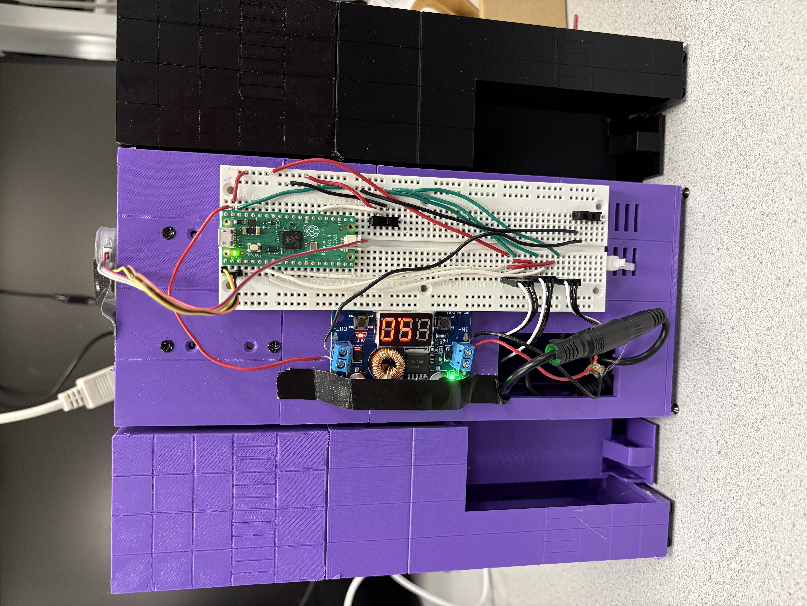
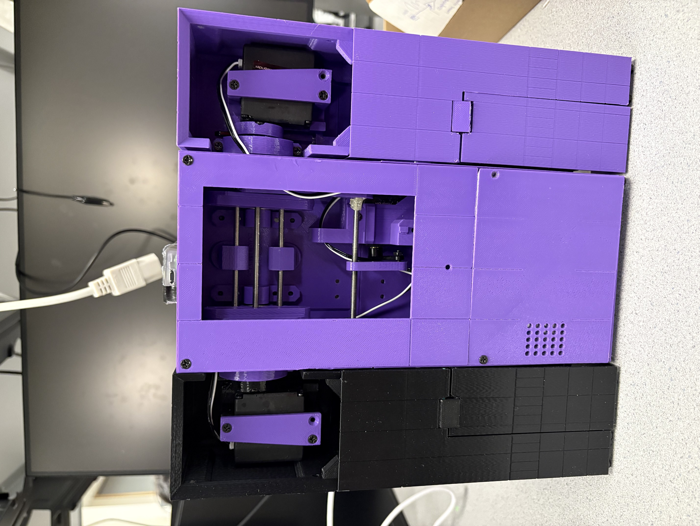
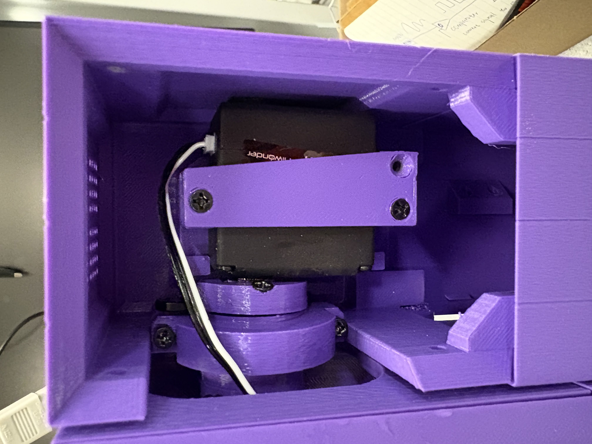
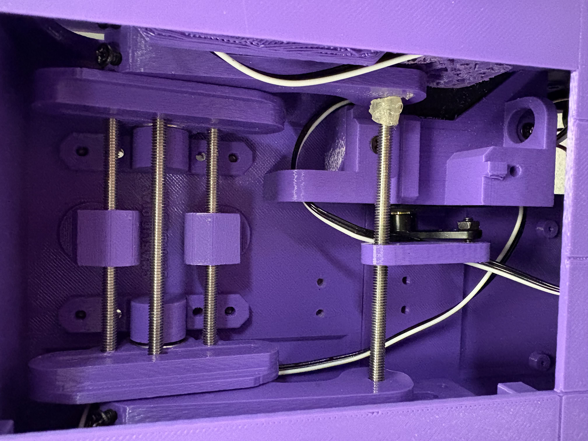
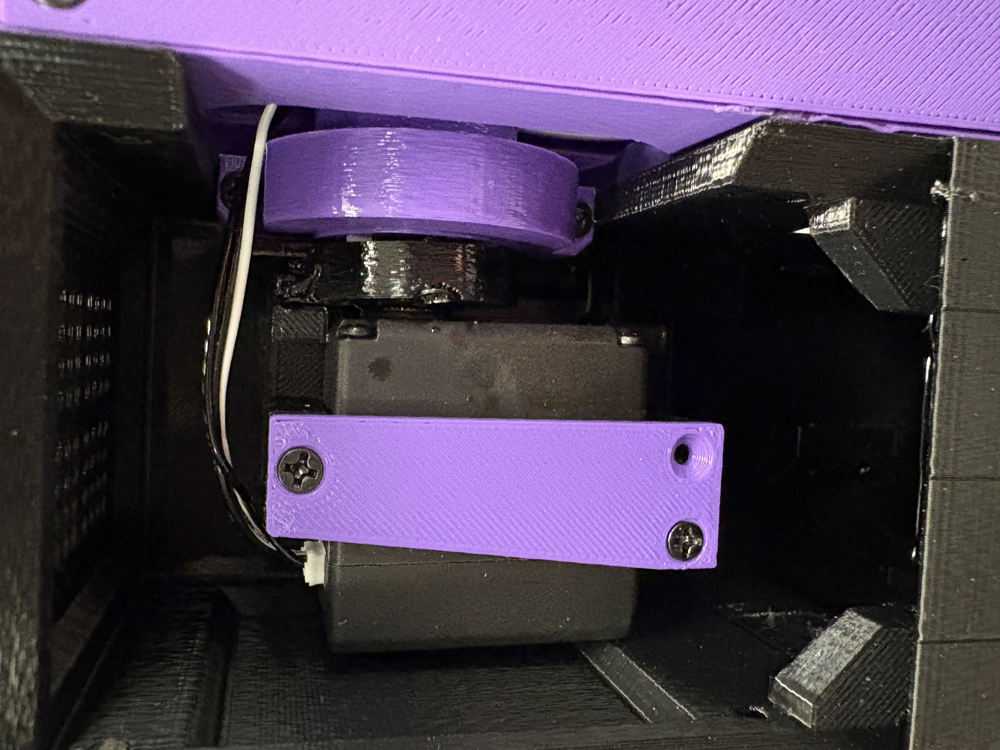

# TARS Robot Controller (RP2040)

This project implements a control system for a TARS-inspired walking robot using the Raspberry Pi Pico (RP2040). It uses three servo motors to drive the robot's legs and achieve a walking gait.

## Project Overview

The application is built using the Pico C SDK and utilizes **Protothreads** for cooperative multitasking. This allows the system to handle multiple tasks concurrently, including:
- **Motor Control**: Smoothly driving servos to target angles with adjustable speeds.
- **Gait Sequencing**: Orchestrating the leg movements to make the robot walk.
- **User Interface**: Processing commands from a serial terminal and a physical button.
- **System Monitoring**: Blinking an LED to indicate activity.

## Hardware Setup

The code is configured for the following connections on the Raspberry Pi Pico:

*   **Servo 1 (Left Leg)**: GPIO 4 (Physical Pin 6)
*   **Servo 2 (Right Leg)**: GPIO 5 (Physical Pin 7)
    *   *Note: Servo 2 is logically inverted in software to move symmetrically with Servo 1.*
*   **Servo 3 (Middle Leg)**: GPIO 6 (Physical Pin 9)
*   **Button**: GPIO 20 (Physical Pin 26) -> Connect to 3.3V (Active High, internal pulldown used)
*   **LED**: Onboard LED (GPIO 25)

**Power Supply**: Ensure you have an adequate external 5V power supply for the servos. Do not power them directly from the Pico's 3.3V or VBUS if the load is high. Connect the grounds of the Pico and the servo power supply.

## Features

*   **Walking Gait**: A pre-programmed sequence of movements to propel the robot forward.
*   **Smooth Movement**: Servos move incrementally (`protothread_motors`) rather than snapping instantly, creating fluid motion.
*   **Calibration**: A startup sequence ("dance") verifies the range of motion for all motors.
*   **Serial Control**: A command-line interface over USB/UART for debugging and manual control.
*   **Button Control**: A single button to toggle the continuous walking mode.

## Usage

### Building
1.  Ensure you have the Pico SDK installed and configured.
2.  Create a build directory: `mkdir build && cd build`
3.  Generate makefiles: `cmake ..`
4.  Build the project: `make`
5.  Flash the `PWM_Demo.uf2` file to your Pico.

### Serial Commands
Connect a serial terminal (e.g., PuTTY, minicom, Serial Monitor) to the Pico's USB port at 115200 baud (or as configured in your SDK).

**Available Commands:**

*   `walk`: Execute a single walking cycle.
*   `walkrepeat`: Start continuous walking.
*   `x`: Stop all motors and cancel current mode.
*   `speed <value>`: Set the servo movement speed (deg/sec).
*   `set <angle>`: Set all motors to a specific angle (0-180).
*   `set1 <angle>`, `set2 <angle>`, `set3 <angle>`: Set individual motor target angles.
*   `test1`, `test2`, `test3`: Enter test mode for a specific motor (oscillates min-max).
*   `offset1 <val>`, `offset2 <val>`, `offset3 <val>`: Set software trim offsets for the motors.
*   `print`: Print current offset values.

## References

*   **[TARS-AI-Community/TARS-AI](https://github.com/TARS-AI-Community/TARS-AI)**: The main repository for the TARS AI community. We refer to this repository frequently for inspiration and collaboration.

## Gallery

### Photos

### Video
[Watch Demo Video (IMG_4806.MOV)](media/IMG_4806.MOV)

